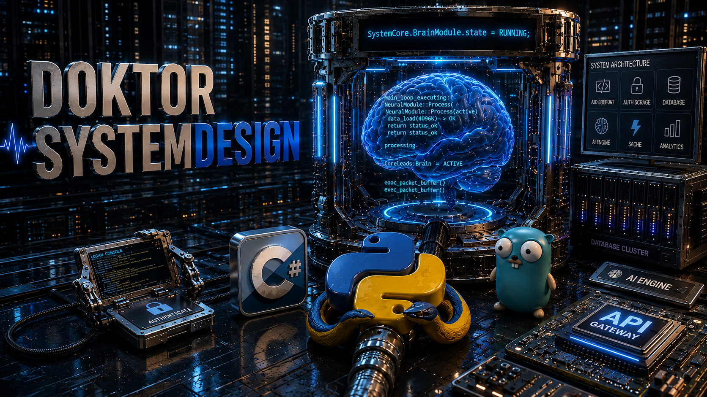

<p align="center">
  
</p>

<p align="center">
  <a href="https://github.com/AndreGustavoms/Doktor-SystemDesign/actions/workflows/validate.yml"></a>
  <a href="LICENSE"></a>
  <a href="VERSION"></a>
</p>

# Doktor System-Design

Repositorio central de padroes leves de arquitetura, qualidade, documentacao, prompts e guias reutilizaveis para projetos de software com apoio de IA.

## Autor

**Andre Gustavo Melo da Silva**  
GitHub: [@AndreGustavoms](https://github.com/AndreGustavoms)

## Proposito

O Doktor System-Design existe para iniciar novos projetos com a IA ja direcionada, sem depender de memoria da conversa e sem gastar contexto lendo o repositorio inteiro.

Ele funciona como um padrao progressivo:

- `AGENTS.md` roteia a leitura por tipo de tarefa;
- `core/GUIA_MINIMO_QUALIDADE.md` define o contrato minimo de qualidade;
- `IA.md` guarda contexto operacional para continuidade;
- `templates/` aceleram a criacao dos arquivos base;
- `guias/` entram somente quando a funcionalidade pedir.

Nao e um framework rigido nem uma stack obrigatoria. E uma base para reduzir retrabalho, alinhar decisoes e manter qualidade previsivel nos proximos projetos.

## Mapa rapido

### Comece por aqui

| Area | Para que serve |
|------|----------------|
| [AGENTS.md](AGENTS.md) | Roteiro de leitura para agentes de IA. Comece por aqui quando for usar o repositorio como contexto operacional. |
| [docs/INDICE-GERAL.md](docs/INDICE-GERAL.md) | Indice completo de documentos, guias e scripts. |
| [docs/GUIA-RAPIDO-USO.md](docs/GUIA-RAPIDO-USO.md) | Fluxo curto para aplicar o system design em um projeto novo. |
| [IA.md](IA.md) | Contexto operacional vivo deste repositorio para continuidade entre sessoes. |

### Padroes e templates

| Area | Para que serve |
|------|----------------|
| [core/](core/) | Padroes obrigatorios: arquitetura, API REST, seguranca, testes, frontend, backend, README, qualidade minima, prompts base, start script e contexto IA. |
| [docs/CORE-PADROES-OBRIGATORIOS.md](docs/CORE-PADROES-OBRIGATORIOS.md) | Indice dos documentos obrigatorios. |
| [docs/STACK-E-ARQUITETURA.md](docs/STACK-E-ARQUITETURA.md) | Stack padrao e criterios de arquitetura por tipo de projeto. |
| [templates/](templates/) | Templates copiaveis de AGENTS, README, IA, deploy, seguranca e ADR. |
| [guias/](guias/) | Guias opcionais de frontend, backend e integracao, usados somente quando a funcionalidade pedir. |
| [docs/GUIAS-OPCIONAIS.md](docs/GUIAS-OPCIONAIS.md) | Indice dos guias reutilizaveis por dominio. |

### Checklists e curadoria

| Area | Para que serve |
|------|----------------|
| [docs/CHECKLIST-PROJETO-PRONTO.md](docs/CHECKLIST-PROJETO-PRONTO.md) | Checklist para validar um projeto antes de entregar ou publicar. |
| [docs/CHECKLIST-PUBLICACAO.md](docs/CHECKLIST-PUBLICACAO.md) | Checklist para revisar identidade, scripts, links e qualidade antes de publicar. |
| [docs/CURADORIA-DOS-GUIAS.md](docs/CURADORIA-DOS-GUIAS.md) | Plano para revisar e transformar guias importados em padroes Doktor. |
| [docs/VALIDACAO-SCRIPTS.md](docs/VALIDACAO-SCRIPTS.md) | Estado de validacao dos instaladores e suite de testes automatizados. |

### Identidade e processo

| Area | Para que serve |
|------|----------------|
| [docs/IDENTIDADE-DOKTOR.md](docs/IDENTIDADE-DOKTOR.md) | Identidade propria do Doktor: autoria local, influencia da origem e direcao visual/tecnica. |
| [docs/PADROES-OBSERVADOS-GITHUB.md](docs/PADROES-OBSERVADOS-GITHUB.md) | Padroes esteticos, arquiteturais e operacionais observados nos repositorios publicos do autor. |
| [docs/DECISOES-DE-IDENTIDADE.md](docs/DECISOES-DE-IDENTIDADE.md) | Registro das decisoes de autoria, marca, stack e identidade publica. |
| [docs/INSTALACAO-EM-OUTROS-PROJETOS.md](docs/INSTALACAO-EM-OUTROS-PROJETOS.md) | Como copiar ou sincronizar estes padroes em outros projetos. |
| [docs/POLITICA-DE-ATUALIZACAO.md](docs/POLITICA-DE-ATUALIZACAO.md) | Como manter guias, stack e sincronizacao com a origem atualizados. |
| [docs/GIT-POLITICA-DE-VERSIONAMENTO.md](docs/GIT-POLITICA-DE-VERSIONAMENTO.md) | Politica de branches, commits e documentacao viva. |

### Scripts e historico

| Area | Para que serve |
|------|----------------|
| [scripts/](scripts/) | Instaladores do comando global de sincronizacao do Doktor System-Design. |
| [scripts/validate-repo.ps1](scripts/validate-repo.ps1) | Validador local usado tambem pela CI. |
| [CHANGELOG.md](CHANGELOG.md) | Historico de versoes e mudancas relevantes. |
| [NOTICE.md](NOTICE.md) | Atribuicao da origem MIT usada como base inicial. |

## Estrutura

```text
Doktor-System-Design/
|-- AGENTS.md
|-- CONTRIBUTING.md
|-- IA.md
|-- LICENSE
|-- NOTICE.md
|-- README.md
|-- VERSION
|-- CHANGELOG.md
|-- assets/
|   `-- social-preview.png
|-- core/
|   |-- DESIGN_SYSTEM_API_REST.md
|   |-- DESIGN_SYSTEM_ARQUITETURA.md
|   |-- DESIGN_SYSTEM_BACKEND.md
|   |-- DESIGN_SYSTEM_ECONOMIA_IA.md
|   |-- DESIGN_SYSTEM_FRONTEND.md
|   |-- DESIGN_SYSTEM_MODULARIDADE.md
|   |-- DESIGN_SYSTEM_README.md
|   |-- DESIGN_SYSTEM_SEGURANCA.md
|   |-- DESIGN_SYSTEM_TESTES.md
|   |-- GUIA-START-APP-SCRIPT.md
|   |-- GUIA_MINIMO_QUALIDADE.md
|   |-- PROMPT_BASE_BACKEND.md
|   |-- PROMPT_BASE_FRONTEND.md
|   `-- TEMPLATE-CONTEXTO-IA.md
|-- docs/
|   |-- CHECKLIST-PUBLICACAO.md
|   |-- CHECKLIST-PROJETO-PRONTO.md
|   |-- CORE-PADROES-OBRIGATORIOS.md
|   |-- CURADORIA-DOS-GUIAS.md
|   |-- DECISOES-DE-IDENTIDADE.md
|   |-- GUIA-RAPIDO-USO.md
|   |-- GIT-POLITICA-DE-VERSIONAMENTO.md
|   |-- GUIAS-OPCIONAIS.md
|   |-- IDENTIDADE-DOKTOR.md
|   |-- INDICE-GERAL.md
|   |-- POLITICA-DE-ATUALIZACAO.md
|   |-- STACK-E-ARQUITETURA.md
|   |-- VALIDACAO-SCRIPTS.md
|   `-- INSTALACAO-EM-OUTROS-PROJETOS.md
|-- guias/
|   |-- backend/
|   |-- frontend/
|   `-- integracao/
|-- templates/
|   |-- ADR-0001-template.md
|   |-- AGENTS-template.md
|   |-- DEPLOY-template.md
|   |-- IA-template.md
|   |-- README-template.md
|   `-- SECURITY-template.md
`-- scripts/
    |-- bash-zsh/
    |-- cmd/
    |-- hooks/
    |-- powershell/
    `-- tests/
```

## Uso recomendado

1. Leia [AGENTS.md](AGENTS.md) para saber quais arquivos abrir em cada tipo de tarefa.
2. Use [core/GUIA_MINIMO_QUALIDADE.md](core/GUIA_MINIMO_QUALIDADE.md) como contrato minimo para qualquer entrega.
3. Use [docs/GUIA-RAPIDO-USO.md](docs/GUIA-RAPIDO-USO.md) para aplicar em projeto novo sem ler tudo.
4. Copie [templates/AGENTS-template.md](templates/AGENTS-template.md) para `AGENTS.md` no projeto destino.
5. Use `templates/` para criar README, IA, deploy, seguranca e ADR.
6. Consulte `guias/` apenas quando a funcionalidade aparecer no escopo.
7. Atualize [IA.md](IA.md) quando houver decisoes estruturais, riscos ou pendencias relevantes.
8. Antes de publicar, confira o estado das escolhas em [docs/DECISOES-DE-IDENTIDADE.md](docs/DECISOES-DE-IDENTIDADE.md).

## Stack padrao

O Doktor System-Design agora usa uma baseline tecnica documentada em [docs/STACK-E-ARQUITETURA.md](docs/STACK-E-ARQUITETURA.md). Resumo:

| Contexto | Padrao |
|----------|--------|
| Frontend app | React + TypeScript + Vite + Tailwind CSS |
| Frontend simples | HTML + CSS + JavaScript |
| Backend comum | Python + Django + Django REST Framework |
| Banco inicial | SQLite |
| Banco em producao | PostgreSQL |
| Deploy backend pequeno/medio | Railway ou plataforma equivalente |
| Automacao | Python, PowerShell e Bash conforme ambiente |

Desvios sao permitidos quando houver motivo tecnico claro e documentado.

## Seguranca e privacidade

Padroes de seguranca e privacidade que todo projeto Doktor deve considerar:

| Documento | Uso |
|-----------|-----|
| [core/DESIGN_SYSTEM_SEGURANCA.md](core/DESIGN_SYSTEM_SEGURANCA.md) | Padroes de seguranca, secrets, auth, validacao e OWASP basico. |
| [templates/SECURITY-template.md](templates/SECURITY-template.md) | Checklist copiavel de seguranca por projeto (auth, auditoria, rate limit, headers). |
| [templates/PRIVACIDADE-LGPD-template.md](templates/PRIVACIDADE-LGPD-template.md) | Documento de privacidade/LGPD para projetos que tratam dados pessoais. |

Regra do repo: todo app com usuario, conta, token ou segredo deve ter `SECURITY.md`;
todo app com dados pessoais deve ter tambem um documento de privacidade/LGPD.

## Custo e economia de tokens

O proposito do Doktor e reduzir o gasto de contexto e capacidade de IA por tarefa.
Os principios estao em [core/DESIGN_SYSTEM_ECONOMIA_IA.md](core/DESIGN_SYSTEM_ECONOMIA_IA.md).
Resumo pratico:

- Siga o roteador ([AGENTS.md](AGENTS.md)) antes de ler qualquer coisa - nao leia "por garantia".
- Leia primeiro o resumo vivo do `IA.md`; so desca ao historico se ele nao bastar.
- Case o nivel do modelo ao risco da tarefa: mecanica -> leve; comum -> intermediario; decisao critica -> avancado.
- Reaproveite cache de prompt e contexto estavel; nao refaca a mesma pergunta "para conferir".

## Validacao

Rode localmente:

```powershell
powershell -NoProfile -ExecutionPolicy Bypass -File scripts/validate-repo.ps1
powershell -NoProfile -ExecutionPolicy Bypass -File scripts/tests/run-tests.ps1
```

O validador (`validate-repo.ps1`) e a suite de testes dos instaladores
(`run-tests.ps1`) rodam na GitHub Actions em push e pull request.

## Licenca e origem

O material base foi importado de um projeto MIT. A atribuicao foi preservada em [NOTICE.md](NOTICE.md) e a licenca esta em [LICENSE](LICENSE).
